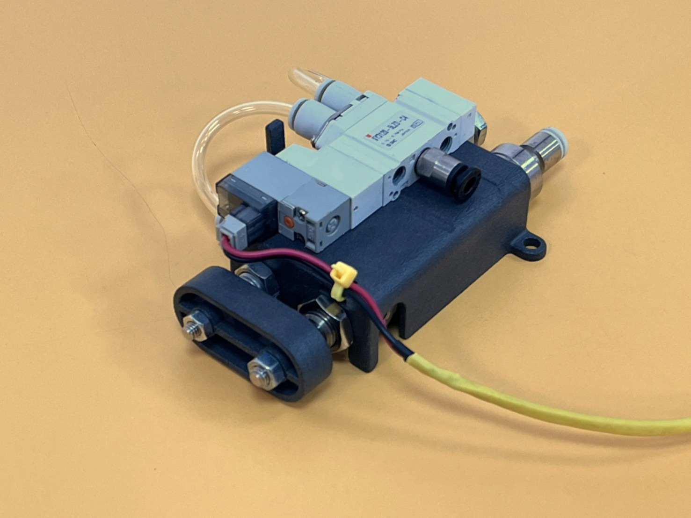
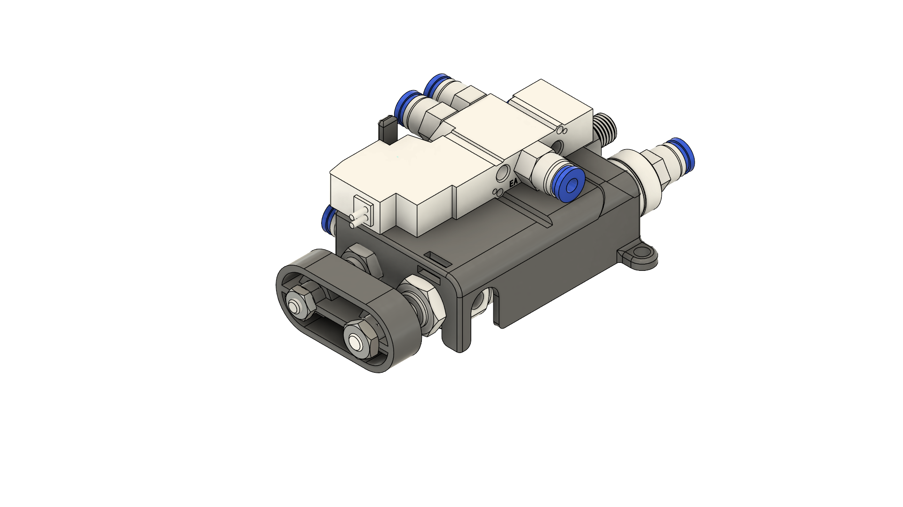

# Pneumatic Actuator Module

  
  

## 💡 Description
The Compact Modular Pneumatic Actuator System is an integrated unit that combines an electrically driven solenoid valve with a precision linear motion assembly to deliver programmable bidirectional pressure control within a single, space-efficient enclosure. Designed for advanced automation, robotic manipulation, and laboratory fluid-handling applications, the system offers exceptional versatility where compactness, responsiveness, and precise pneumatic regulation are required.

The device actively provides both vacuum pressure for gripping and positive pressure for release, enabling accurate, repeatable, and high-speed operation in tasks such as object handling, assembly, or automated dispensing. The integrated solenoid valve ensures rapid switching and fine pressure modulation, while the linear actuator mechanism provides stable and consistent displacement under dynamic loads.

Its modular configuration allows seamless integration into distributed pneumatic networks or multi-actuator systems, minimizing external tubing and wiring complexity while enhancing reliability. Compact yet powerful, the unit’s ability to generate both suction and blow-off functions makes it particularly suitable for precision grasp-and-release mechanisms in robotic end-effectors, pick-and-place machines, and laboratory automation platforms.

The actuator operates on a regulated compressed-air source and conforms to the 24-V industrial power standard, ensuring compatibility with programmable logic controllers (PLCs), embedded microcontrollers, and other industrial control architectures. This integration of compact design, fast pneumatic response, and industrial interoperability positions the system as an efficient and adaptable solution for next-generation robotic and automation applications.

---

## 📘 Overview

This project provides the design files, electrical connections, and control instructions for a pneumatic actuator assembly.  
The module consists of:
- A **pneumatic linear actuator**  
- A **solenoid valve (5/2 or 3/2 type)**  
- **Air tubing and fittings**  
- **Electrical control wiring**

The goal is to create a plug-and-play actuator unit for testing and integration in mechatronic systems.

---

## ⚙️ Features

- Compact integrated design  
- Dual air channels for actuation control  
- Solenoid-driven switching (24V or 12V depending on model)  
- Easy tubing connection (Ø4 mm push fitting)  
- Mountable on standard frames  
---

## 🧩 Components

| Component | Model |
|------------|--------|
| 5/2-way Pneumatic Valve | **SY3120-5LZD-C4** |
| Pneumatic Cylinder | **CJ2E10-30Z** |
| Pneumatic Cylinder | **PBDAS-16x30** |
---

## 📏 Technical Specifications
- Parameter	Value
- Dimensions	120 × 60 × 35 mm
- Weight	170 g
- Supply Pressure	Up to 5 bar
- Operating Voltage	24 V DC (industrial standard)
- Air Volume (per stroke)	≈ 6032 mm³
- Pneumatic Fittings	Ø 4 mm push-fit connectors
- Control Interface	PLC / Microcontroller I/O (digital trigger)
---

## 🧠 Example
🎥 Demo Video: https://youtu.be/TiwMHKVwiJI
