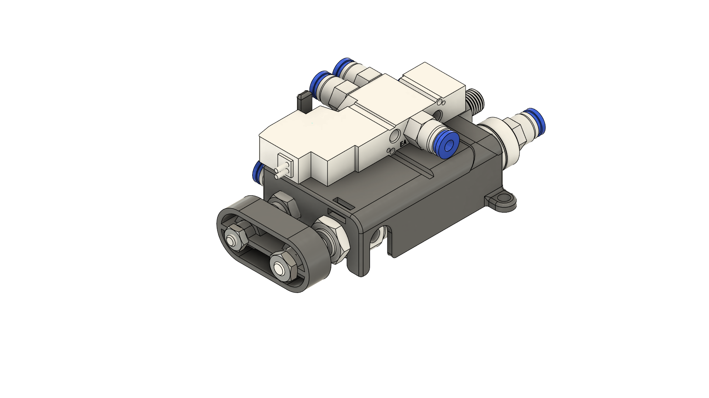

# Pneumatic Actuator Module

  
  

A compact and modular pneumatic actuator system with integrated solenoid valve and linear motion assembly.  
Designed for use in automation, robotics, or laboratory fluid control systems.

---

## 📘 Overview

This project provides the design files, electrical connections, and control instructions for a pneumatic actuator assembly.  
The module consists of:
- A **pneumatic linear actuator**  
- A **solenoid valve (5/2 or 3/2 type)**  
- **Air tubing and fittings**  
- **Electrical control wiring**

The goal is to create a plug-and-play actuator unit for testing and integration in mechatronic systems.

---

## ⚙️ Features

- Compact integrated design  
- Dual air channels for actuation control  
- Solenoid-driven switching (24V or 12V depending on model)  
- Easy tubing connection (Ø4 mm push fitting)  
- Mountable on standard frames  
---

## 🧩 Components

| Component | Model |
|------------|--------|
| 5/2-way Pneumatic Valve | **SY3120-5LZD-C4** |
| Pneumatic Cylinder | **CJ2E10-30Z** |
| Pneumatic Cylinder | **PBDAS-16x30** |
---

## 🧠 Example
Youtube here!!!
